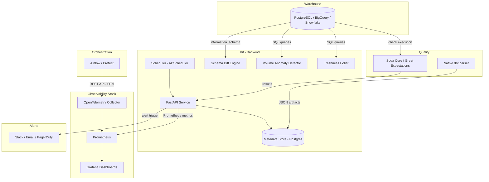

<p align="center">
  <h1 align="center">🔭 ObservaKit</h1>
  <p align="center">Data Observability Starter Kit for Small Teams</p>
</p>

<p align="center">
  
  
  
</p>

<p align="center">
  <a href="#quickstart">Quickstart</a> •
  <a href="#features">Features</a> •
  <a href="#architecture">Architecture</a> •
  <a href="docs/adding_checks.md">Adding Checks</a> •
  <a href="docs/alerting_setup.md">Alert Setup</a> •
  <a href="#contributing">Contributing</a>
</p>

---

> A self-hosted, Docker-Compose-ready observability layer that gives small data teams the 5 core observability pillars — **Freshness, Volume, Quality, Schema Drift, and Pipeline Health** — without needing a paid platform like Monte Carlo or Metaplane.

## Who Is This For?

- 1–5 person data teams at seed/Series-A startups
- Teams using **Airflow or Prefect** for orchestration
- Teams using **dbt** for transformations
- Warehouses: **PostgreSQL, BigQuery, or Snowflake**
- Pain: pipelines breaking silently, dashboards going stale, no single alert channel

## Design Principles

- **Zero vendor lock-in** — everything runs on open-source infra you control
- **Plug-in, don't replace** — works alongside existing Airflow/dbt setups; no DAG refactoring required
- **Opinionated but minimal** — ships with sensible defaults; quickstart in under 10 minutes
- **Progressive complexity** — each observability layer is independent; adopt what you need

## Features

### 1. 🕐 Freshness Monitor
Detects stale tables by tracking `max(updated_at)` and comparing against your SLA thresholds.

### 2. 📊 Volume Monitor
Tracks row counts per table per DAG run with Z-score anomaly detection against a 7-day rolling average.

### 3. ✅ Quality Checks
Ships with pre-built Soda Core and Great Expectations templates for null checks, duplicates, value ranges, and referential integrity.

### 4. 🔀 Schema Drift Detector
Snapshots `information_schema` and diffs against previous snapshots. Detects added/removed columns and type changes.

### 5. 🚀 Pipeline Health
Pulls Airflow/Prefect metrics via REST API and OpenTelemetry. Pre-built Grafana dashboards for success rates, task durations, and SLA misses.

### 6. 💸 FinOps Tracker
Tracks Snowflake compute credits and BigQuery bytes billed natively, preventing runaway dashboard queries and exploding ETL costs.

### 7. 🛠️ Native dbt Integration
Parses `run_results.json` and `manifest.json` directly into ObservaKit's Postgres database, eliminating the need for third-party dbt packages like Elementary. 

## Tech Stack

| Layer | Tool |
|-------|------|
| Data Quality | Soda Core + Great Expectations |
| dbt Observability | Native `run_results.json` parser |
| Pipeline Metrics | OpenTelemetry + Prometheus |
| Dashboards | Grafana |
| Backend API | FastAPI + SQLAlchemy |
| Metadata Store | PostgreSQL |
| Orchestration | Airflow / Prefect REST API |
| Containerisation | Docker Compose |
| Alerting | Slack webhooks, Email (SMTP) |

## Quickstart

### Prerequisites
- Docker + Docker Compose
- Python 3.10+
- A supported SQL warehouse (PostgreSQL, BigQuery, or Snowflake)

### 1. Clone the repo
```bash
git clone https://github.com/willowvibe/ObservaKit.git
cd ObservaKit
```

### 2. Configure
```bash
cp .env.example .env
# Edit .env with your warehouse credentials and Airflow URL
```

### 3. Start the stack
```bash
docker-compose up -d
```

### 4. Run the Demo Data Generator (Optional)
To instantly see ObservaKit in action without hooking up your own database, generate 7 days of simulated history and inject data anomalies (like schema drift and volume drops):
```bash
make demo
```
*(Once run, the dashboards will immediately populate with simulated pipeline failures and data quality alerts).*

### 5. Open Grafana
Visit `http://localhost:3000` (default: `admin / admin`)
Dashboards are auto-provisioned under the **Data Observability** folder.

### 5. Explore the API
Visit `http://localhost:8000/docs` for the interactive Swagger UI.

### 6. Add your first quality checks
```bash
cp checks/templates/soda/no_nulls_on_pk.yml checks/my_project/orders.yml
# Edit the YAML to point to your table
```

Checks run every hour by default. Override in `config/kit.yml`.

## Use Cases

### Data Migrations (Zero-Drift Guarantee)
When migrating from legacy on-prem to a Cloud Lakehouse (e.g., Postgres to Snowflake), run ObservaKit in parallel to guarantee **zero schema drift** and **100% volume parity**. 
- Connect ObservaKit to both source and destination.
- Catch unsupported data type mappings early.
- Ensure every single row makes it across.
This turns ObservaKit into an automated audit layer for complex data migrations.

### Pipeline Audits & Cost Observability
Instantly identify silent failures, stale dashboards, and missing SLA targets. Future releases will include native integration for Cost Observability (e.g., Snowflake compute credits and BigQuery bytes billed).

## Architecture



## Project Structure

## Project Structure

```
ObservaKit/
├── docker-compose.yml
├── .env.example
├── config/
│   ├── kit.yml
│   └── warehouses/
├── checks/
│   ├── templates/
│   └── examples/
├── backend/
│   ├── main.py
│   ├── models.py
│   ├── scheduler.py
│   └── routers/
├── landing-page/       <-- Vite/React GitHub Pages site
├── dbt_integration/    <-- Native parsing logic for dbt artifacts
├── connectors/
├── alerts/
├── otel/
├── prometheus/
├── grafana/
│   ├── dashboards/
│   └── provisioning/
├── tests/
└── docs/
```

## Contributing

Contributions welcome! Please read the guidelines before opening a PR.

### Good First Issues
- Add a new warehouse connector
- Add a Grafana dashboard for a new use case
- Write a quality check template for a common schema
- Improve documentation or quickstart clarity

## License

MIT License — free to use, modify, and distribute.

---

**Built by [WillowVibe DataSynapse](https://www.willowvibe.com)** — AI-first data enablement for modern teams.
