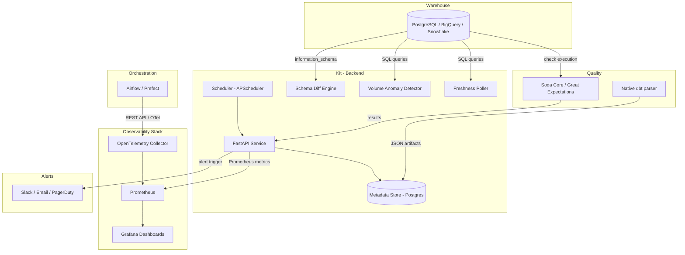
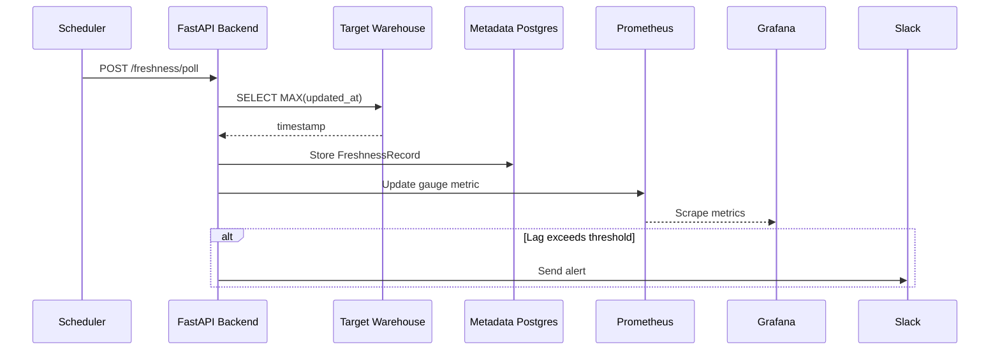

# ObservaKit Architecture

## Overview

ObservaKit is a self-hosted data observability layer built on open-source tools. It provides 5 core observability pillars for small data teams without requiring paid platforms.

## System Architecture

## Components

### FastAPI Backend (`backend/`)
The central service that:
- Exposes REST API endpoints for all 5 pillars
- Stores results in the metadata PostgreSQL database
- Emits Prometheus metrics for Grafana dashboards
- Dispatches alerts via Slack and email
- Runs APScheduler for standalone mode (no Airflow dependency)

### Connectors (`connectors/`)
Pluggable connectors follow abstract base classes:
- **WarehouseConnector**: `get_max_timestamp()`, `get_row_count()`, `get_schema()`
- **OrchestratorConnector**: `list_dags()`, `get_dag_runs()`, `get_task_instances()`

Supported: PostgreSQL, BigQuery, Snowflake, Airflow, Prefect.

### Observability Stack
- **OpenTelemetry Collector** — receives OTLP from Airflow, exports to Prometheus
- **Prometheus** — scrapes metrics from backend and OTel Collector
- **Grafana** — 4 auto-provisioned dashboards

### Data Flow

## Docker Compose Services

| Service | Image | Port | Purpose |
|---------|-------|------|---------|
| `backend` | Custom (Python 3.11) | 8000 | FastAPI API + scheduler |
| `postgres` | postgres:16-alpine | 5433 | Metadata store |
| `prometheus` | prom/prometheus:v2.51.0 | 9090 | Metrics storage |
| `grafana` | grafana/grafana:11.0.0 | 3000 | Dashboards |
| `otel-collector` | otel/opentelemetry-collector-contrib:0.98.0 | 4317, 4318, 8889 | OTel pipeline |

## Database Schema

```mermaid
erDiagram
    FreshnessRecord {
        int id PK
        string table_name
        string timestamp_column
        datetime last_updated_at
        float lag_seconds
        string status
        datetime checked_at
    }
    VolumeRecord {
        int id PK
        string table_name
        string dag_id
        int row_count
        float rolling_avg
        float deviation_pct
        bool is_anomaly
        datetime recorded_at
    }
    CheckResult {
        int id PK
        string check_name
        string table_name
        string check_type
        bool passed
        float metric_value
        text details
        datetime executed_at
    }
    SchemaSnapshot {
        int id PK
        string table_name
        json columns_json
        datetime snapshot_at
    }
    SchemaDiff {
        int id PK
        string table_name
        string change_type
        string column_name
        string old_value
        string new_value
        datetime detected_at
    }
    AlertLog {
        int id PK
        string alert_type
        string channel
        string table_name
        text message
        datetime sent_at
        bool success
    }
    PipelineRun {
        int id PK
        string orchestrator
        string dag_id
        string run_id
        string state
        datetime start_time
        datetime end_time
        float duration_seconds
        datetime recorded_at
    }
    DbtRunResult {
        int id PK
        string run_id
        string model_name
        string status
        float execution_time
        int rows_affected
        string compiled_sql
        string error_message
        datetime executed_at
    }
    FinOpsRecord {
        int id PK
        string warehouse
        string entity_name
        string metric_name
        float metric_value
        float estimated_cost_usd
        datetime recorded_at
    }
```

