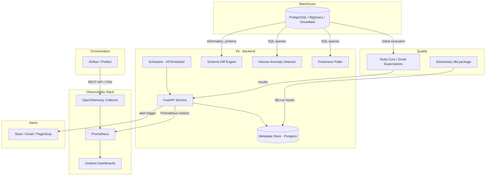

Here's the complete `.md` file — copy and save as `DATA_OBSERVABILITY_STARTER_KIT.md` in your repo root:

```markdown
# Data Observability Starter Kit for Small Teams

> A self-hosted, Docker-Compose-ready observability layer that gives small data teams the 5 core observability pillars — **Freshness, Volume, Quality, Schema Drift, and Pipeline Health** — without needing a paid platform like Monte Carlo or Metaplane.

---

## Who Is This For?

- 1–5 person data teams at seed/Series-A startups
- Teams using **Airflow or Prefect** for orchestration
- Teams using **dbt** for transformations
- Warehouses: **PostgreSQL, BigQuery, or Snowflake**
- Pain: pipelines breaking silently, dashboards going stale, no single alert channel

---

## Design Principles

- **Zero vendor lock-in** — everything runs on open-source infra you control
- **Plug-in, don't replace** — works alongside existing Airflow/dbt setups; no DAG refactoring required
- **Opinionated but minimal** — ships with sensible defaults; quickstart in under 10 minutes
- **Progressive complexity** — each observability layer is independent; adopt what you need

---

## Tech Stack

| Layer | Tool | Reason |
|-------|------|--------|
| Data Quality Checks | Soda Core (YAML-first) + Great Expectations (Python-first, optional) | Soda is easier to configure; GX has wider adoption; both templates provided |
| dbt-native observability | Elementary OSS (`dbt-data-reliability`) | Plugs directly into dbt runs; detects anomalies, schema drift, freshness natively as dbt tests |
| Pipeline metrics / tracing | OpenTelemetry Collector + Prometheus | Vendor-neutral; Airflow 3.0 has native OTel support |
| Dashboards & alerting | Grafana (Prometheus datasource) | Industry standard; auto-provisioned JSON dashboard templates included |
| Backend API | FastAPI + SQLAlchemy | Thin layer for custom metadata, webhook endpoints, and check orchestration |
| Metadata store | PostgreSQL | Simple, reliable; stores test results, run history, alert state |
| Orchestration connector | Airflow REST API / Prefect API | Pulls DAG run status, task durations, SLA misses without modifying DAGs |
| Containerisation | Docker Compose (primary) + Helm chart (stretch) | One-command local spin-up; Helm for Kubernetes teams |
| Alerting dispatch | Slack webhooks, Email (SMTP), PagerDuty (stretch) | Alerts go where the team already lives |
| Config format | YAML (per datasource + per check suite) | Low barrier; matches Soda Core conventions |

---

## Five Observability Pillars → Features

### 1. Freshness Monitor
**Problem:** Table hasn't updated in X hours but the pipeline shows "Success."

- Connects to your warehouse, reads `max(updated_at)` (or a configurable timestamp column) per table
- Compares against a user-defined SLA (e.g., `orders` table must refresh every 2 hours)
- Emits Prometheus gauge: `data_freshness_lag_seconds{table="orders"}`
- Triggers Slack/email alert if lag exceeds threshold

**Config example:**
```yaml
freshness:
  - table: public.orders
    timestamp_column: updated_at
    warn_after: 1h
    fail_after: 2h
    alert: slack
```

---

### 2. Volume Monitor
**Problem:** A DAG silently loaded 0 rows and nobody noticed.

- Tracks row counts per table per DAG run
- Stores history in Postgres; computes a rolling 7-day average
- Alerts when row count deviates > X% from the rolling average (simple Z-score anomaly detection)
- Prometheus metric: `data_volume_rows{table="orders", dag="load_orders"}`

**Config example:**
```yaml
volume:
  - table: public.orders
    dag_id: load_orders
    anomaly_threshold: 0.3   # alert if ±30% deviation from 7d rolling avg
    alert: slack
```

---

### 3. Quality Checks
**Problem:** Null primary keys, negative revenue amounts, and duplicate invoice IDs slip into prod.

- Ships with pre-built check templates in `checks/templates/`:
  - `no_nulls_on_pk.yml`
  - `no_duplicates.yml`
  - `value_range.yml`
  - `referential_integrity.yml`
  - `row_count_min.yml`
- User copies and adapts templates into `checks/my_project/`
- Soda Core or Great Expectations runs checks on schedule; results written to Postgres
- Grafana dashboard shows pass/fail trend per table per check over time

**Soda check example:**
```yaml
# checks/my_project/orders.yml
checks for public.orders:
  - row_count > 0
  - missing_count(order_id) = 0
  - duplicate_count(order_id) = 0
  - min(amount) >= 0
```

---

### 4. Schema Drift Detector
**Problem:** Upstream team silently renames a column and your downstream dbt model breaks.

- Uses **Elementary's** `dbt-data-reliability` package as the dbt-layer detector
- Also includes a standalone Python script that snapshots `information_schema` for any warehouse and diffs against the last snapshot stored in Postgres
- Alerts on:
  - Column added
  - Column removed
  - Data type changed
  - Column renamed (heuristic-based)

**Alert payload example:**
```
⚠️ Schema Drift Detected: public.orders
  - Column `customer_id` type changed: INTEGER → VARCHAR
  - Column `discount_pct` added (nullable FLOAT)
  Detected at: 2026-03-07 21:00 UTC
```

---

### 5. Pipeline Health (Airflow / Prefect)
**Problem:** No single view of DAG SLA misses, task failure rates, or longest-running tasks.

- Pulls metrics via Airflow REST API or native OTel emission (Airflow 3.0)
- Configures OpenTelemetry Collector to scrape Airflow metrics and forward to Prometheus
- Pre-built Grafana dashboard (`pipeline_health.json`) auto-provisioned, showing:
  - DAG run success rate (7-day rolling)
  - Task duration P50 / P95
  - SLA miss count
  - Failure heatmap by DAG × hour-of-day

---

## Repository Structure

```
data-observability-kit/
│
├── docker-compose.yml           # One-command spin-up
├── .env.example                 # All config vars documented
├── README.md                    # Quickstart in <10 min
│
├── config/
│   ├── kit.yml                  # Master config: datasources, alerts, schedules
│   └── warehouses/
│       ├── postgres.example.yml
│       ├── bigquery.example.yml
│       └── snowflake.example.yml
│
├── checks/                      # Quality check definitions
│   ├── templates/               # Copy-paste starters (Soda + GX)
│   │   ├── soda/
│   │   └── great_expectations/
│   └── examples/                # Real working examples with sample data
│
├── dbt_integration/             # Elementary dbt package setup guide + macros
│   └── README.md
│
├── otel/
│   └── collector-config.yml     # OTel Collector → Prometheus pipeline config
│
├── prometheus/
│   └── prometheus.yml           # Scrape configs
│
├── grafana/
│   └── dashboards/              # Auto-provisioned JSON dashboards
│       ├── pipeline_health.json
│       ├── data_freshness.json
│       ├── volume_anomaly.json
│       └── quality_trends.json
│
├── backend/                     # FastAPI service
│   ├── main.py
│   ├── routers/
│   │   ├── checks.py            # Trigger & store check results
│   │   ├── freshness.py         # Freshness polling & lag calculation
│   │   ├── schema_diff.py       # Schema snapshot & diff engine
│   │   └── webhooks.py          # Receive Airflow/Prefect callbacks
│   ├── models.py                # SQLAlchemy models
│   └── scheduler.py             # APScheduler for standalone (no Airflow) mode
│
├── connectors/                  # Warehouse + orchestrator connectors
│   ├── airflow.py
│   ├── prefect.py
│   ├── postgres.py
│   ├── bigquery.py
│   └── snowflake.py
│
├── alerts/
│   ├── slack.py
│   └── email.py
│
├── tests/                       # Pytest suite (unit + integration)
│   ├── test_freshness.py
│   ├── test_volume.py
│   ├── test_schema_diff.py
│   └── test_connectors.py
│
└── docs/
    ├── architecture.md          # Architecture diagram (Mermaid)
    ├── adding_checks.md         # How to write custom quality checks
    └── alerting_setup.md        # Slack / email / PagerDuty setup guide
```

---

## Architecture Diagram



---

## Quickstart

### Prerequisites
- Docker + Docker Compose
- Python 3.10+
- An Airflow instance (local or remote) or Prefect server
- A supported SQL warehouse (Postgres, BigQuery, or Snowflake)

### 1. Clone the repo
```bash
git clone https://github.com/YOUR_ORG/data-observability-kit.git
cd data-observability-kit
```

### 2. Configure
```bash
cp .env.example .env
# Edit .env with your warehouse credentials and Airflow URL
cp config/warehouses/postgres.example.yml config/warehouses/postgres.yml
# Edit postgres.yml with your connection details
```

### 3. Start the stack
```bash
docker-compose up -d
```

### 4. Open Grafana
Visit `http://localhost:3000` (default: `admin / admin`)
Dashboards are auto-provisioned under the **Data Observability** folder.

### 5. Add your first quality checks
```bash
cp checks/templates/soda/no_nulls_on_pk.yml checks/my_project/orders.yml
# Edit the YAML to point to your table
```
Checks run every hour by default. Override in `config/kit.yml`.

---

## 4-Week Execution Plan

| Week | Milestone | Deliverables |
|------|-----------|--------------|
| **1** | Core infra + Pipeline Health | Docker Compose stack, OTel Collector config, Airflow connector, `pipeline_health.json` Grafana dashboard |
| **2** | Freshness + Volume monitors | Warehouse connectors (Postgres + BigQuery), freshness poller, Z-score volume anomaly, Slack alerts |
| **3** | Quality checks + Schema drift | Soda Core runner integration, schema snapshot/diff engine, Elementary dbt package guide, 3 additional Grafana dashboards |
| **4** | Polish + OSS launch | README quickstart (<10 min), `docs/architecture.md` with Mermaid diagram, GitHub Actions CI, demo GIF, community launch posts |

---

## Roadmap (Post-Launch)

- [ ] Snowflake connector
- [ ] Prefect v2/v3 connector
- [ ] Helm chart for Kubernetes deployment
- [ ] PagerDuty alerting integration
- [ ] Lineage tracking via OpenLineage + Marquez
- [ ] Cost-per-pipeline tracking (cloud warehouse query costs)
- [ ] Hosted / managed version (SaaS path)

---

## Contributing

Contributions welcome. Please read `CONTRIBUTING.md` before opening a PR.

### Good first issues
- Add a new warehouse connector
- Add a Grafana dashboard for a new use case
- Write a quality check template for a common schema
- Improve documentation or quickstart clarity

---

## License

MIT License — free to use, modify, and distribute.

---

## Built By

**WillowVibe DataSynapse** — AI-first data enablement for modern teams.  
Website · GitHub · LinkedIn
```

***

Save this as `DATA_OBSERVABILITY_STARTER_KIT.md` at the repo root for now and then split the relevant sections into `README.md`, `docs/architecture.md`, and `docs/adding_checks.md` as you scaffold the actual repo. The Mermaid diagram will render natively on GitHub without any extra tooling. [github](https://github.com/elementary-data/elementary)